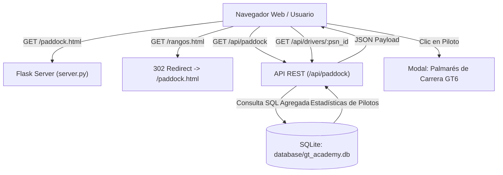

# GT Academy: Paddock Oficial de Pilotos (GT6 Driver Hub)

**Fecha:** 2026-09-27  
**Estado:** Aprobado  
**Tipo:** Rediseño Arquitectónico y Funcional  

---

## 1. Resumen y Motivación

En la plataforma competitiva **GT Academy** (campeonato disputado en **Gran Turismo 6 para PlayStation 3**), el sistema anterior utilizaba una tabla estática en `rangos.html` clasificando a los pilotos en categorías arbitrarias (*Bronce, Plata, Oro, Platino, Diamante*). 

Este enfoque presentaba limitaciones:
1. Era estático y no reflejaba el rendimiento en tiempo real en la pista.
2. Podía resultar desmotivador para los participantes clasificados en niveles inferiores.
3. No aprovechaba la estética ni la mística de las salas online y perfiles de Gran Turismo 6.

### Solución Aprobada
Sustituir por completo el concepto de "Rangos" por el **PADDOCK OFICIAL DE PILOTOS GT6 (`paddock.html`)**:
- Todos los pilotos compiten en una parrilla unificada con su **PSN ID**.
- Cada piloto dispone de una **Tarjeta de Piloto (Driver Card)** interactiva inspirada en la interfaz de Gran Turismo 6 y la telemetría WEC.
- Las estadísticas son **100% dinámicas y reales**, calculadas directamente desde la base de datos SQLite (`race_results` y `drivers`).
- Se añade un **Modal de Palmarés** para consultar el historial detallado ronda por ronda de cada piloto (fechas, circuitos, autos de GT6 utilizados y puntos).
- Se actualiza la navegación global y se mantiene una redirección transparente de `/rangos.html` a `/paddock.html`.

---

## 2. Arquitectura del Sistema



---

## 3. Especificación Backend & Base de Datos

### 3.1 Consultas de Datos (`database/db.py`)
Se implementa una función `get_paddock_drivers()` que agrega el palmarés histórico de cada piloto registrado:

```sql
SELECT 
    d.id AS driver_id,
    d.psn_id,
    d.country,
    COALESCE(SUM(rr.points), 0) AS total_points,
    COUNT(rr.id) AS races_count,
    SUM(CASE WHEN rr.position = 1 THEN 1 ELSE 0 END) AS wins,
    SUM(CASE WHEN rr.position BETWEEN 1 AND 3 THEN 1 ELSE 0 END) AS podiums,
    SUM(CASE WHEN rr.is_pole = 1 THEN 1 ELSE 0 END) AS poles,
    SUM(CASE WHEN rr.is_fastest_lap = 1 THEN 1 ELSE 0 END) AS fastest_laps
FROM drivers d
LEFT JOIN race_results rr ON rr.driver_id = d.id
GROUP BY d.id
ORDER BY total_points DESC, wins DESC, podiums DESC, d.psn_id ASC;
```

Adicionalmente, para cada piloto se identifica su **auto insignia** (`signature_car`): el modelo de GT6 con el que ha acumulado más victorias o participaciones. Si un piloto es nuevo y no tiene carreras registradas, se le asigna por defecto el auto icónico de GT6 (*Ford GT '06* o *Nissan GT-R Concept*).

### 3.2 Endpoints en `server.py`
1. `GET /api/paddock`: Devuelve la lista completa de pilotos con sus estadísticas agregadas y auto insignia.
2. `GET /api/drivers/<psn_id>`: Devuelve los datos detallados del piloto junto con el desglose cronológico de todas sus carreras disputadas (`history`).
3. `GET /rangos.html` y `GET /rangos`: Redirección `301/302` hacia `/paddock.html`.

---

## 4. Especificación Frontend & Componentes (`paddock.html`)

### 4.1 Barra Superior de Control del Paddock
- **Buscador en tiempo real:** Campo con filtrado instantáneo por `psn_id` o `país`.
- **Filtros de Clasificación:**
  - ⚡ *Puntos Totales* (Orden por defecto)
  - 🏆 *Más Victorias*
  - 🥇 *Más Podios*
  - 🔤 *Alfabético (A-Z)*
- **Contador de Parrilla:** Badge dinámico indicando el total de pilotos activos registrados.

### 4.2 Tarjeta de Piloto GT6 (`.gt6-driver-card`)
Estructura y diseño visual:
1. **Encabezado:**
   - Bandera del país (`assets/country/<pais>.png`).
   - `psn_id` en tipografía deportiva destacada.
   - Badge de estatus: "PILOTO OFICIAL GT6".
2. **Exhibición de Máquina (Machine Showcase):**
   - Miniatura de render oficial de GT6 del auto insignia (`assets/cars/*.jpg`).
   - Logo vectorial oficial del fabricante (`assets/brands/*.svg` detectado automáticamente).
   - Nombre del auto oficial de GT6.
3. **Métricas de Telemetría (Grid 2x2):**
   - **Victorias:** Conteo de carreras ganadas en P1.
   - **Podios:** Conteo de carreras en P1, P2 o P3.
   - **Poles / VR:** Total de pole positions y vueltas rápidas.
   - **Puntos:** Total acumulado en la carrera deportiva del piloto.
4. **Acción:**
   - Botón interactivo *"Ver Palmarés"* con icono de telemetría.

### 4.3 Modal de Palmarés ("Pasaporte de Piloto GT6")
Al pulsar *"Ver Palmarés"*:
- Muestra el encabezado del piloto con su bandera y efectividad (% de podios/victorias).
- Tabla de historial de carreras:
  - Temporada y Ronda.
  - Nombre de la carrera y circuito.
  - Auto GT6 utilizado (con logo de fabricante).
  - Posición final, puntos obtenidos, pole position o vuelta rápida.

### 4.4 Actualización de Navegación Global
En todas las páginas de la plataforma (`index.html`, `resultados.html`, `ranking.html`, `calendario.html`, `setup.html`, `conceptos.html`, `galeria.html`, `discord.html`):
- En el submenú **Eventos**:
  - Cambiar enlace `<a href="rangos.html">Tabla de Rangos</a>` por `<a href="paddock.html">Paddock de Pilotos</a>`.

---

## 5. Manejo de Errores y Casos Borde

1. **Pilotos sin carreras registradas:**
   - Las métricas se inicializan a `0`.
   - Se muestra la etiqueta "Debutante en preparación" en lugar de datos vacíos o rotos.
2. **Países no especificados o 'pdi':**
   - Se utiliza por defecto la insignia oficial de Polyphony Digital (`assets/country/pdi.png`).
3. **Fallas en la solicitud a la API:**
   - En caso de error de red o backend, se renderiza una tarjeta con mensaje de alerta amigable y botón de reintento ("Reconectar con Paddock").
4. **Dispositivos móviles y pantallas reducidas:**
   - La cuadrícula es completamente responsiva:
     - Pantallas de escritorio (>= 992px): 3 columnas.
     - Tablets (768px - 991px): 2 columnas.
     - Teléfonos móviles (< 768px): 1 columna completa.

---

## 6. Plan de Pruebas y Verificación

1. **Pruebas de Base de Datos y Backend:**
   - Ejecutar consultas de prueba en `gt_academy.db` verificando que los acumulados de puntos y victorias coinciden exactamente con la suma de `race_results`.
   - Probar respuesta JSON de `/api/paddock` y `/api/drivers/<psn_id>`.
   - Verificar que `curl -I http://localhost:3000/rangos.html` redirige a `/paddock.html`.
2. **Pruebas de Frontend e Interfaz:**
   - Cargar `http://localhost:3000/paddock.html` y verificar carga limpia de tarjetas.
   - Probar filtrado en vivo por texto en la barra de búsqueda.
   - Probar ordenamiento por victorias, podios y puntos.
   - Probar apertura, navegación y cierre del modal de palmarés.
   - Verificar la coherencia en la barra de navegación de todos los archivos HTML del sitio.
